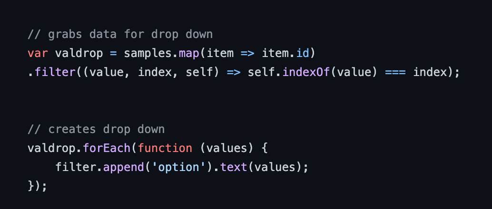
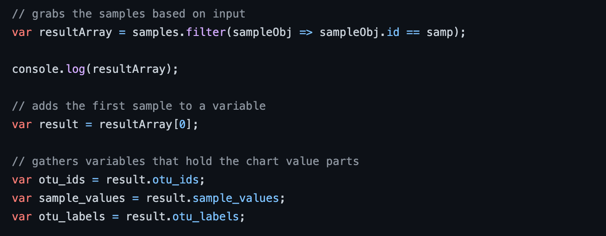
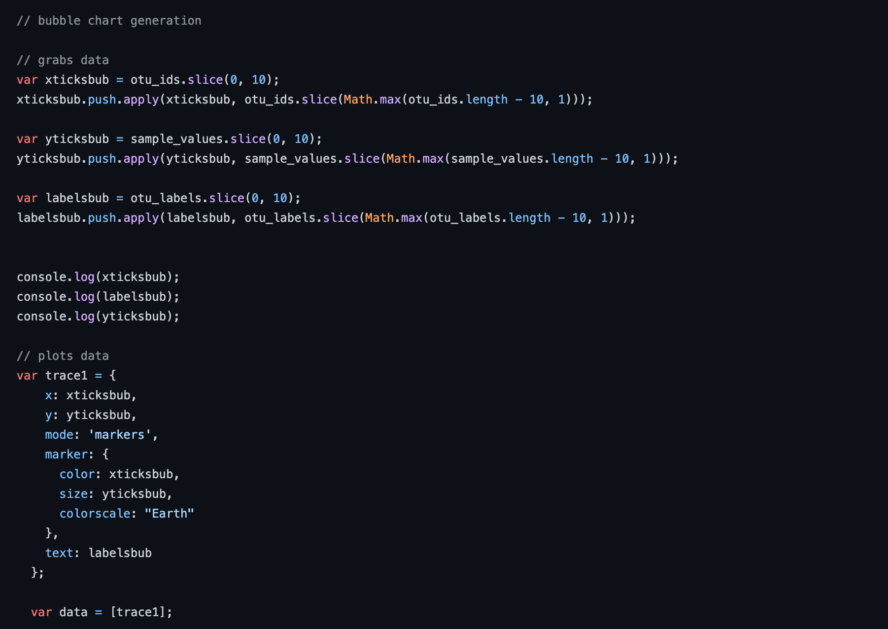
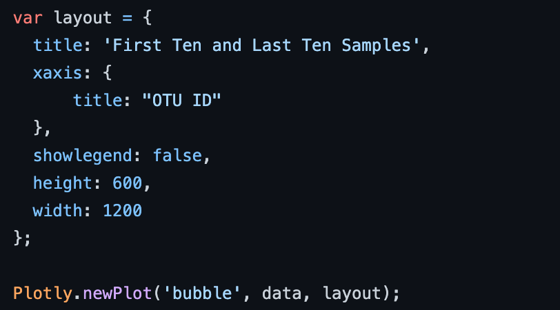
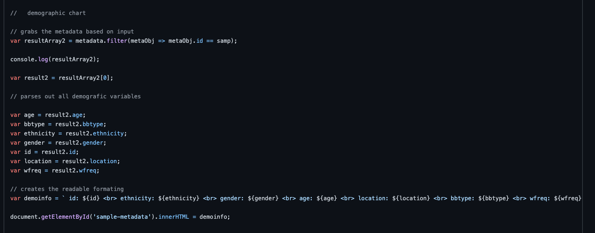
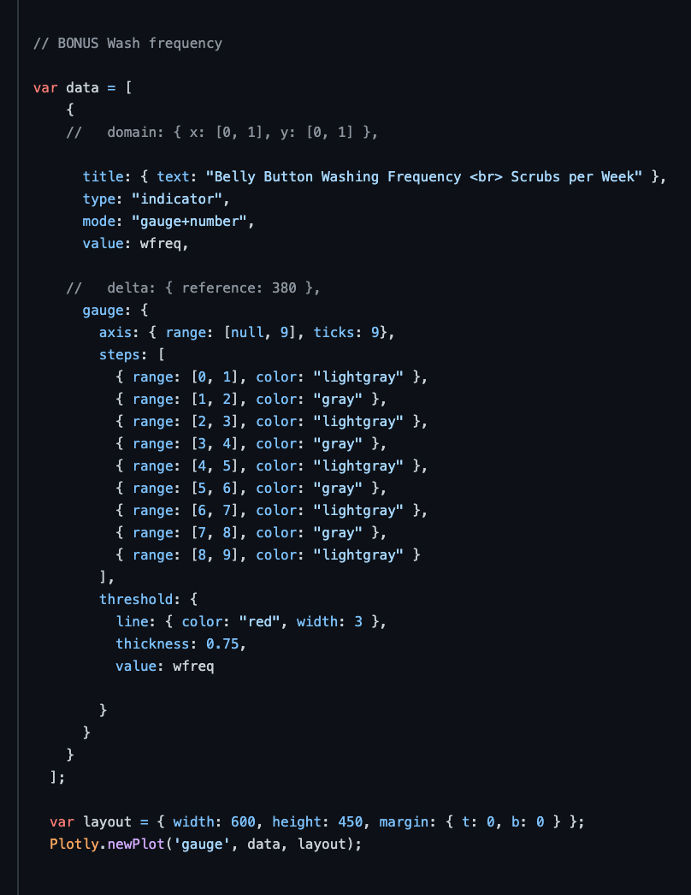
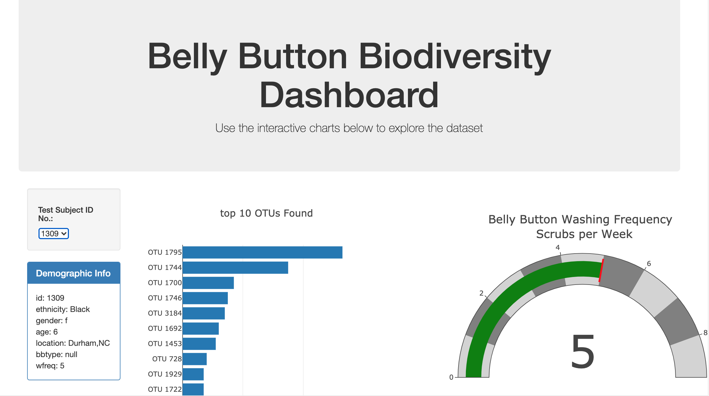
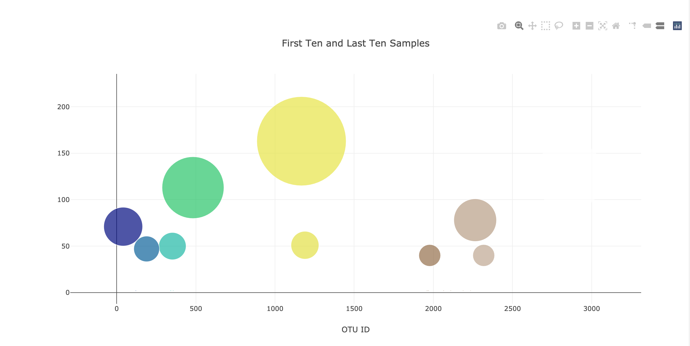

# Belly Button Bio Diversity Project With Plotly 

## Project Summary

Link to the Finnished Dashboard: https://chandlergibbons.github.io/Plot.ly_Homework/

For this project I build an interactive dashboard to explore the Belly Button Biodiversity dataset: http://robdunnlab.com/projects/belly-button-biodiversity/ 
This data set catalogs the microbes that colonize human navels.

The dataset reveals that a small handful of microbial species (also called operational taxonomic units, or OTUs, in the study) were present in more than 70% of people, while the rest were relatively rare. Click the link to the finnished dashboard above to view the final product. 

Technolgies: Javascript, HTML, CSS, Plotly, D3, JSON

## Plotly Build Description

1. First I used the D3 library to read in samples.json.

2. then I grabed all the data nessesary for my drop down for selecting id. 

3. I then created a horizontal bar chart next to a dropdown menu to display the top 10 OTUs found in that individual.

* I used sample_values as the values, otu_ids as the labels, and otu_labels as the hovertext for the chart.

4. Next I built out a bubble chart that displays each sample from the selected id.

* I used otu_ids for the x values, sample_values for the y values, sample_values for the marker size, otu_ids for the marker colors, and otu_labels for the text values.

5. The next step was to build out the meta data display table

* I parsed out the selected id into the metadata variables I needed.
* Then I reformated the variables for HTML use.

6. The Next step as a bonus I also included a gauge chart to plot the weekly washing frequency of the individual id.

* This required that I create a range list to parce out the gauge sections into diferent colors.

7. The last step was to deploy to github pages. Heres the finnished product

