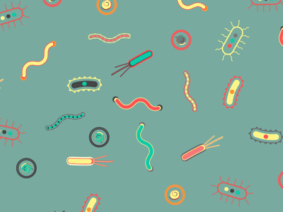

# Belly Button Bio Diversity Project With Plotly 

Link to the Finnished Dashboard: https://chandlergibbons.github.io/Plot.ly_Homework/

For this project I build an interactive dashboard to explore the Belly Button Biodiversity dataset: http://robdunnlab.com/projects/belly-button-biodiversity/ 
This data set catalogs the microbes that colonize human navels.

The dataset reveals that a small handful of microbial species (also called operational taxonomic units, or OTUs, in the study) were present in more than 70% of people, while the rest were relatively rare. Click the link to the finnished dashboard above to view the final product. 

